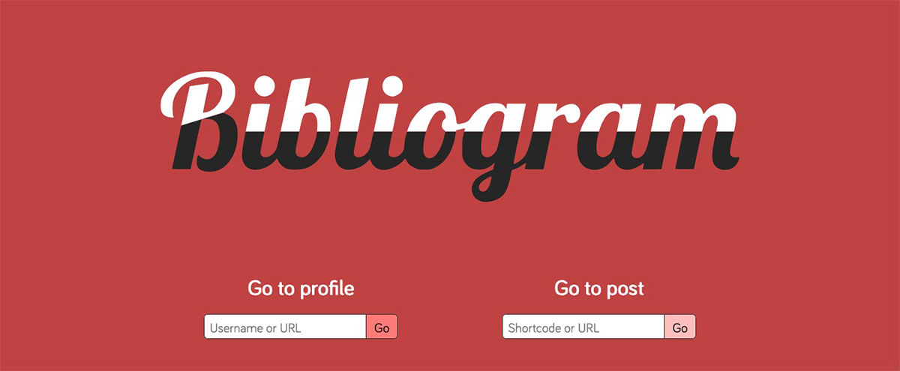

# Bibliogram pour YunoHost

[](https://dash.yunohost.org/appci/app/bibliogram)    
[](https://install-app.yunohost.org/?app=bibliogram)

*[Read this readme in english.](./README.md)* 

> *Ce package vous permet d'installer Bibliogram rapidement et simplement sur un serveur YunoHost.  
Si vous n'avez pas YunoHost, consultez [le guide](https://yunohost.org/#/install) pour apprendre comment l'installer.*

## Vue d'ensemble

Bibliogram est un site Web qui prend les données de profil public d'Instagram et les met dans une page plus conviviale qui se charge plus rapidement, donne des images téléchargeables, élimine les publicités, génère des flux RSS et ne vous invite pas à vous inscrire.

**Version incluse :** 1.0.0

## Captures d'écran



## Démo

* [Démo officielle](https://bibliogram.art/)

## Configuration
Bibliogram s'installe sur un domaine dédié comme `bibliogram.domain.tld`.  
Vous pouvez configurer Bibliogram en modifiant le fichier `/var/www/bibliogram/config.js` et en vous aidant de la [documentation](https://git.sr.ht/~cadence/bibliogram-docs/tree/master/docs/Configuring.md)

## Documentation

 * Documentation officielle : https://git.sr.ht/~cadence/bibliogram-docs
 * Documentation YunoHost : https://yunohost.org/#/app_bibliogram_fr

## Caractéristiques spécifiques YunoHost

#### Support multi-utilisateur

* L'authentification LDAP est-elle prise en charge ? **Non**
* L'application peut-elle être utilisée par plusieurs utilisateurs ? **Oui**

#### Architectures supportées

* x86-64 - [](https://ci-apps.yunohost.org/ci/apps/bibliogram/)
* ARMv8-A - [](https://ci-apps-arm.yunohost.org/ci/apps/bibliogram/)

## Liens

 * Signaler un bug : https://github.com/YunoHost-Apps/bibliogram_ynh/issues
 * Dépôt de l'application principale : https://git.sr.ht/~cadence/bibliogram
 * Site web YunoHost : https://yunohost.org/

---

## Informations pour les développeurs

Merci de faire vos pull request sur la [branche testing](https://github.com/YunoHost-Apps/bibliogram_ynh/tree/testing).

Pour essayer la branche testing, procédez comme suit.
```
sudo yunohost app install https://github.com/YunoHost-Apps/bibliogram_ynh/tree/testing --debug
ou
sudo yunohost app upgrade bibliogram -u https://github.com/YunoHost-Apps/bibliogram_ynh/tree/testing --debug
```
